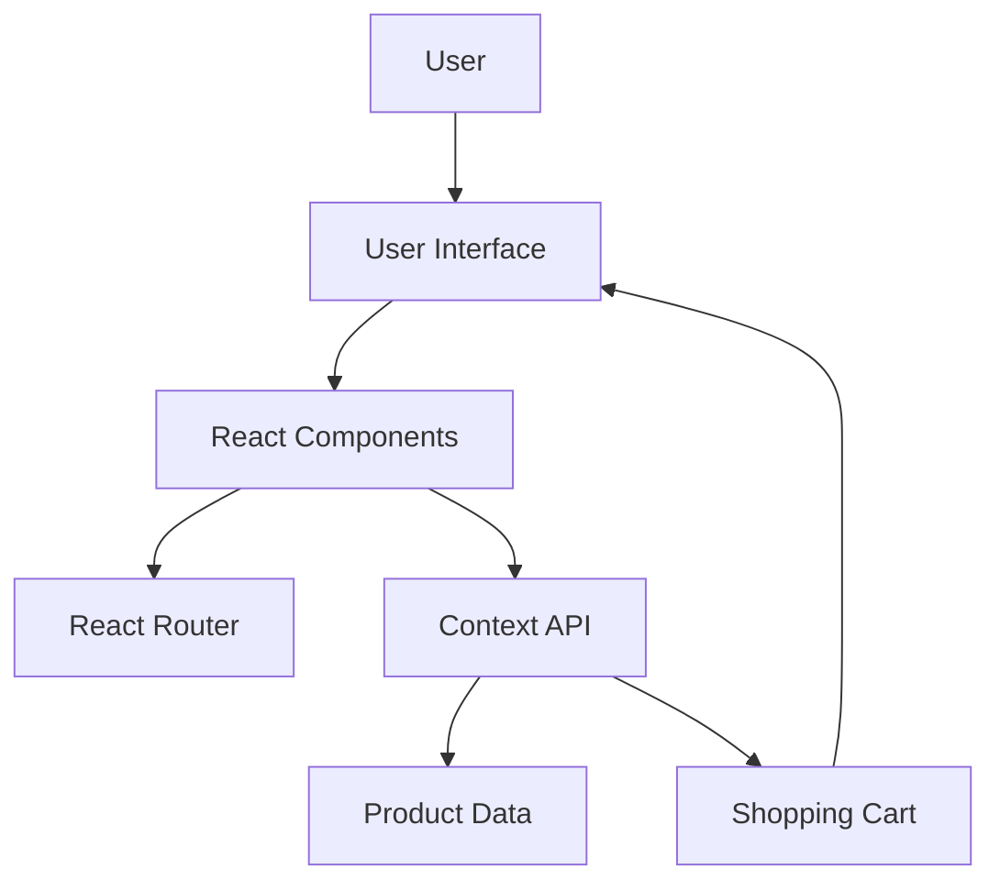
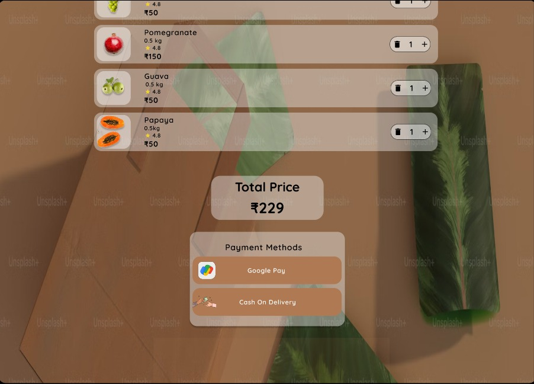
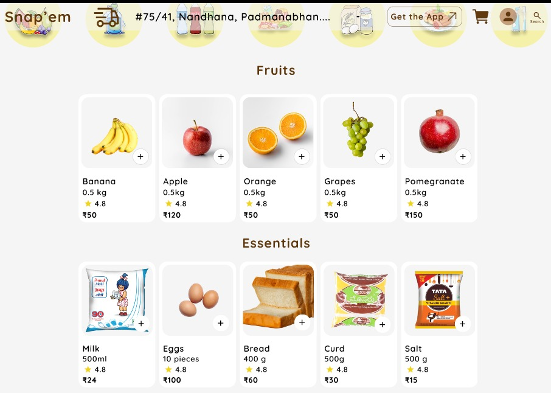
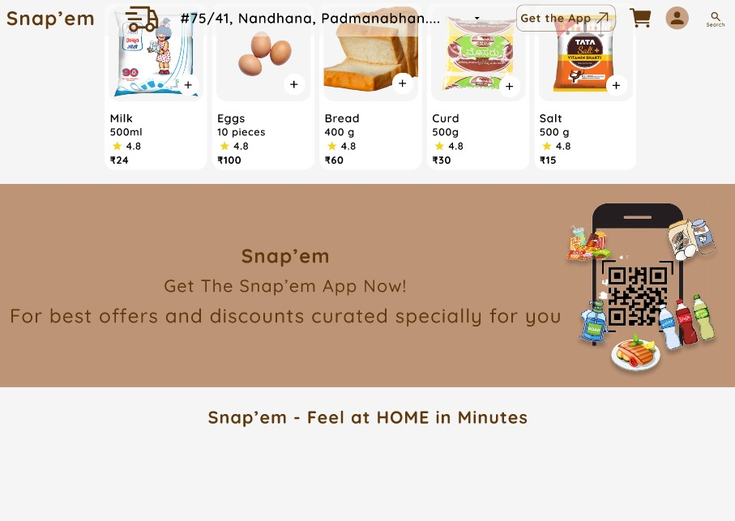
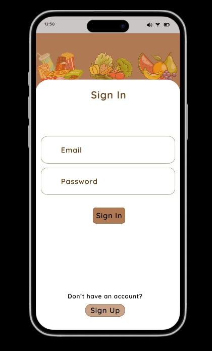
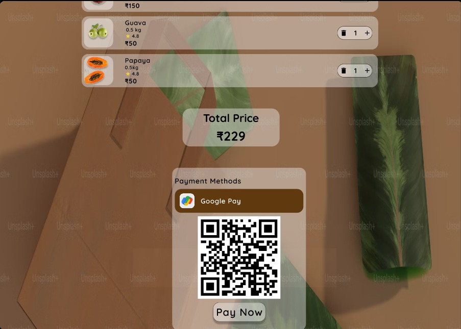
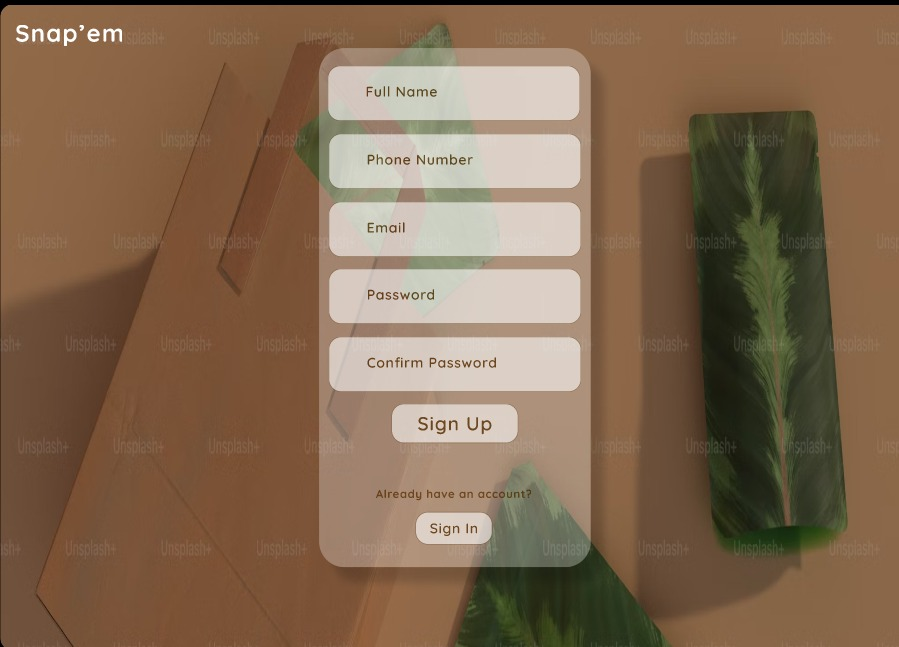
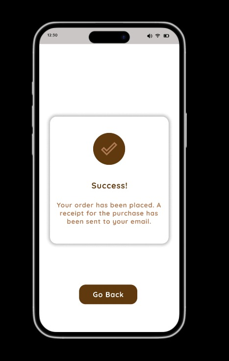
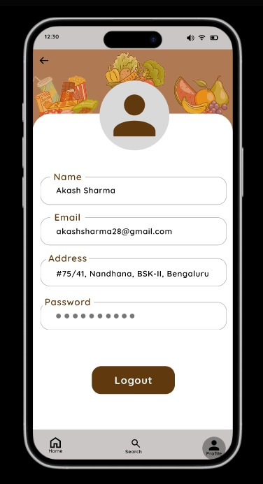
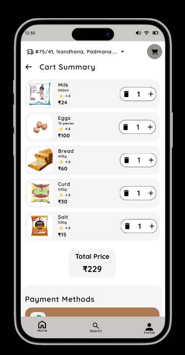

# Snap'em – Grocery Delivery UI

Snap'em is a modern grocery delivery web application designed to provide users with a seamless online grocery shopping experience. The application features an intuitive user interface, product browsing, shopping cart management, user authentication pages and responsive layouts to demonstrate modern frontend development and UI/UX principles.

This project was developed using **React**, **TypeScript**, **Vite**, and **Tailwind CSS**.

# Project Features

- Modern onboarding experience with Splash Screen.
- User authentication through Sign Up and Sign In pages.
- Browse grocery products from the home page.
- Search products efficiently.
- View product details and add items to the shopping cart.
- Manage shopping cart before checkout.
- Simulate multiple payment methods.
- View order confirmation after successful checkout.
- Access and manage user profile.
- Responsive interface built using reusable React components.

# Technologies Used

## Frontend

- React
- TypeScript
- Vite
- Tailwind CSS

## Routing

- React Router DOM

## State Management

- React Context API

## Icons

- Lucide React

## Development Tools

- ESLint

# System Architecture



# System Workflow

1. User launches the Snap'em application.
2. Homepage displays featured grocery products.
3. User browses available grocery items.
4. Products are added to the shopping cart.
5. Cart updates dynamically using the Context API.
6. User proceeds through the checkout flow.
7. Payment interface is displayed.
8. Order confirmation page completes the shopping experience.

# Project Structure

```text
snapem_uiux
│
├── src/
│   ├── components/
│   ├── context/
│   ├── data/
│   ├── pages/
│   ├── types/
│   ├── App.tsx
│   └── main.tsx
│
├── public/
├── screenshots/
│
├── package.json
├── vite.config.ts
└── README.md
```

# Application Pages

- Splash Screen
- Home
- Product Listing
- Search
- Shopping Cart
- Payment
- Order Confirmation
- User Profile
- Sign In
- Sign Up

# Local Setup

## Clone the Repository

```bash
git clone https://github.com/Sinchana46/snapem_uiux.git
```

## Navigate to the Project Directory

```bash
cd snapem_uiux
```

## Install Dependencies

```bash
npm install
```

## Start the Development Server

```bash
npm run dev
```

The application will be available at the local address displayed in the terminal (typically `http://localhost:5173`).

# Screenshots

The following screenshots illustrate the complete user journey through the Snap'em Grocery Delivery application.

---

### User Authentication

| Splash Screen | Sign Up |
|---------------|---------|
|  |  |

| Sign In | Home |
|----------|------|
|  |  |

---

### Product Discovery

| Search | Product Listing |
|--------|-----------------|
|  |  |

---

### Shopping Experience

| Shopping Cart | Payment |
|---------------|---------|
|  |  |

| Order Confirmation | User Profile |
|-------------------|--------------|
|  |  |

---

<details>

<summary><strong>View Additional Screens</strong></summary>

<br>

### Additional Home Screens

| Home Screen 2 | Home Screen 3 |
|---------------|---------------|
|  |  |

### Additional Shopping Screens

| Home Screen | Cart |
|-------------|------|
|  |  |

| Sign In | Payment Features |
|----------------|------------------|
|  |  |

| UPI Payment | Sign Up |
|-------------|---------|
|  |  | 

| UPI Confirmation | COD Confirmation |
|------------------|------------------|
|  |  |

| User Profile | Cart Page |
|--------------|-----------|
|  |  |

</details>

# Project Highlights

- Modern React application
- TypeScript implementation
- Responsive UI
- Component-based architecture
- React Router navigation
- Context API state management
- Reusable React components
- Tailwind CSS styling

# Future Enhancements

- Backend integration
- Product database
- User authentication
- Online payment gateway
- Wishlist functionality
- Order history
- Product categories
- Real-time inventory
- Admin dashboard
