# Snap'em – Grocery Delivery UI

Snap'em is a modern grocery delivery web application designed to provide users with a seamless online grocery shopping experience. The application features an intuitive user interface, product browsing, shopping cart management, user authentication pages and responsive layouts to demonstrate modern frontend development and UI/UX principles.

This project was developed using **React**, **TypeScript**, **Vite**, and **Tailwind CSS**.

# Project Features

- Browse grocery products through a clean and responsive interface.
- View featured grocery items on the homepage.
- Search products quickly.
- Add products to the shopping cart.
- Manage shopping cart items.
- User authentication interface (Sign In & Sign Up).
- User profile page.
- Payment workflow interface.
- Order confirmation pages.
- Responsive design across multiple devices.

# Technologies Used

## Frontend

- React
- TypeScript
- Vite
- Tailwind CSS

## Routing

- React Router DOM

## State Management

- React Context API

## Icons

- Lucide React

## Development Tools

- ESLint

# System Architecture

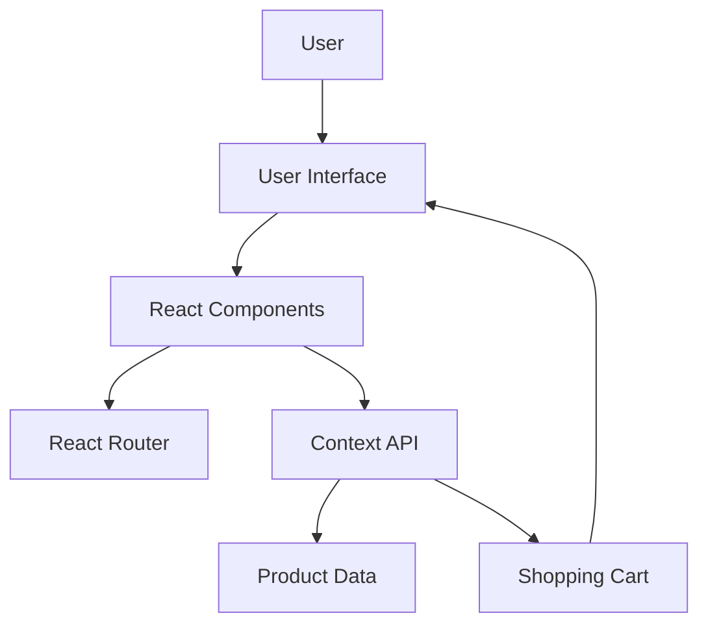

# System Workflow

1. User launches the Snap'em application.
2. Homepage displays featured grocery products.
3. User browses available grocery items.
4. Products are added to the shopping cart.
5. Cart updates dynamically using the Context API.
6. User proceeds through the checkout flow.
7. Payment interface is displayed.
8. Order confirmation page completes the shopping experience.

# Project Structure

```text
snapem_uiux
│
├── src/
│   ├── components/
│   ├── context/
│   ├── data/
│   ├── pages/
│   ├── types/
│   ├── App.tsx
│   └── main.tsx
│
├── public/
├── screenshots/
│
├── package.json
├── vite.config.ts
└── README.md
```

# Application Pages

- Splash Screen
- Home
- Product Listing
- Search
- Shopping Cart
- Payment
- Order Confirmation
- User Profile
- Sign In
- Sign Up

# Local Setup

## Clone the Repository

```bash
git clone https://github.com/Sinchana46/snapem_uiux.git
```

## Navigate to the Project Directory

```bash
cd snapem_uiux
```

## Install Dependencies

```bash
npm install
```

## Start the Development Server

```bash
npm run dev
```

The application will be available at the local address displayed in the terminal (typically `http://localhost:5173`).

# Screenshots

## Home Page

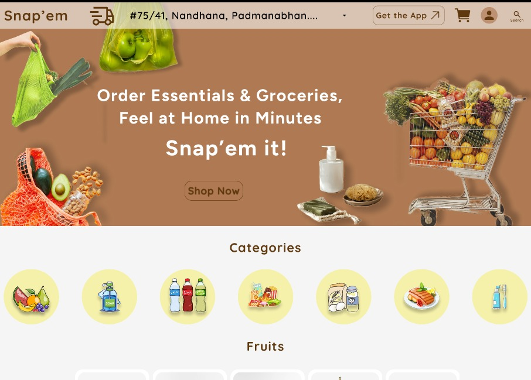

## Product Listing

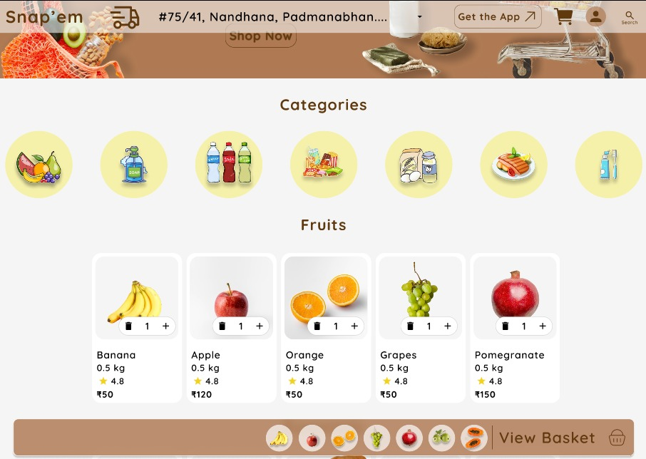

## Shopping Cart

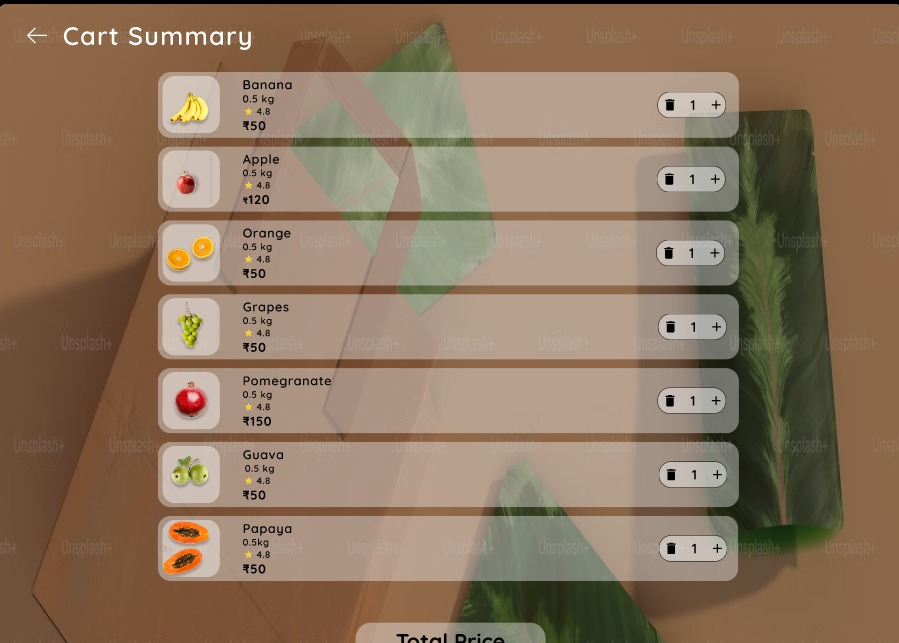

## Search

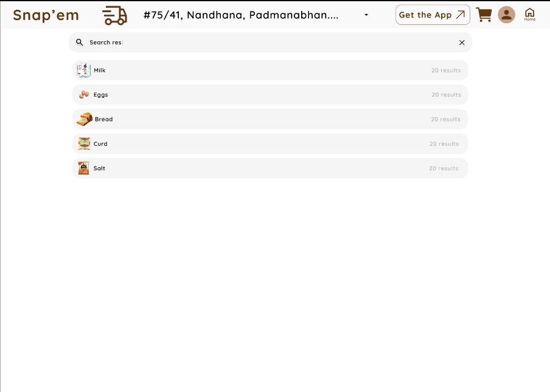

## User Profile

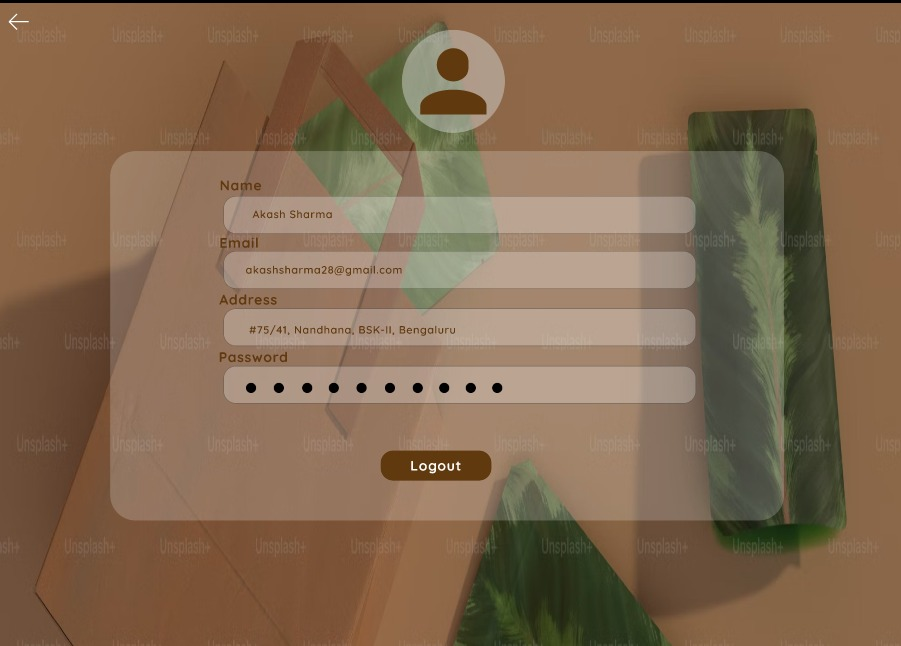

## Sign In

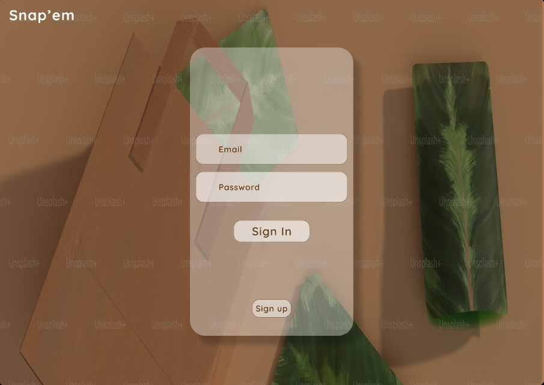

## Sign Up

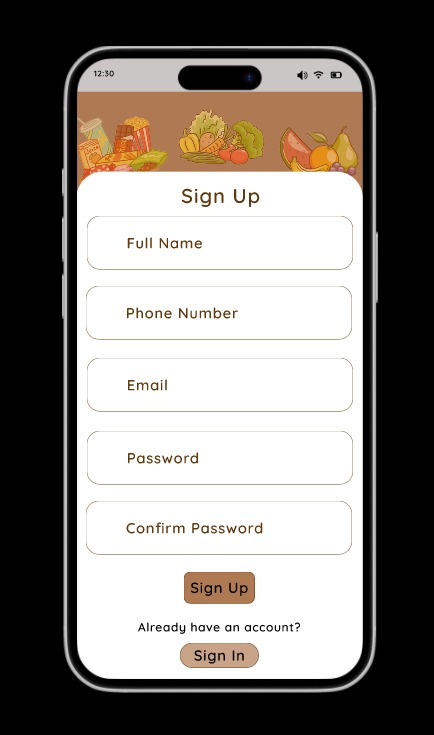

## Payment

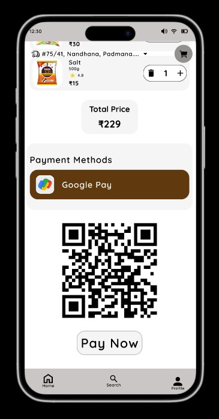

## Order Confirmation

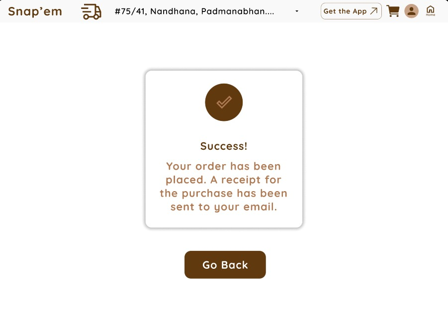

## Additional Screens

| Splash Screen | Home Screen |
|---------------|-------------|
| 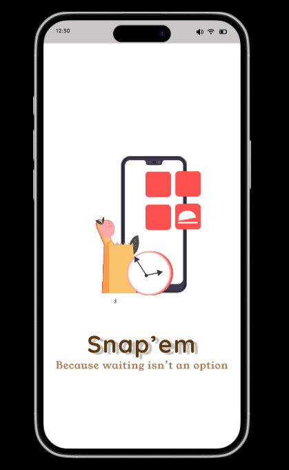 | 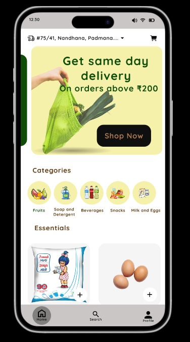 |

| Cart | Search |
|------|--------|
| 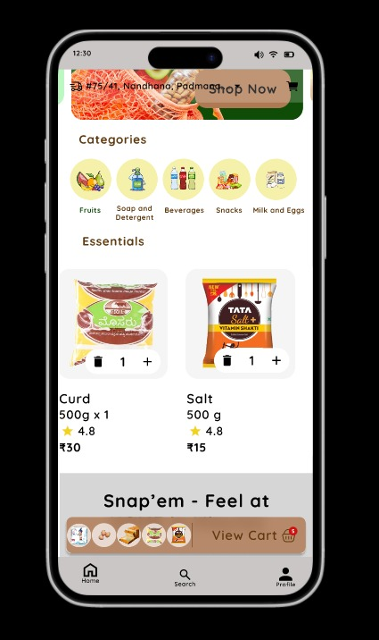 |  |

| UPI Confirmation | COD Confirmation |
|------------------|------------------|
| 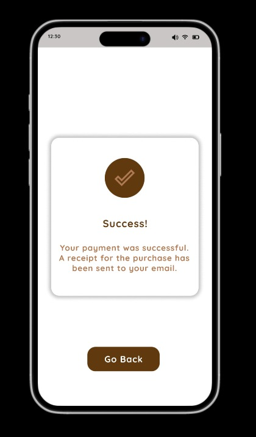 | 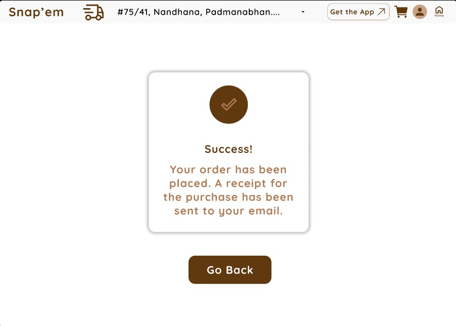 |

# Project Highlights

- Modern React application
- TypeScript implementation
- Responsive UI
- Component-based architecture
- React Router navigation
- Context API state management
- Reusable React components
- Tailwind CSS styling

# Future Enhancements

- Backend integration
- Product database
- User authentication
- Online payment gateway
- Wishlist functionality
- Order history
- Product categories
- Real-time inventory
- Admin dashboard
